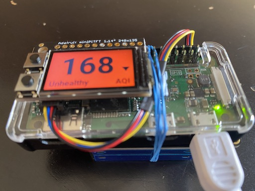
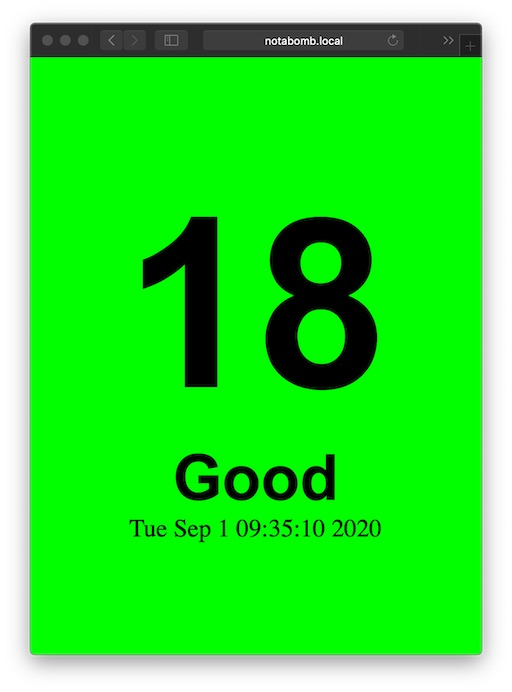

# Air Quality Index (AQI) Gadget
Python code for an AQI sensor + display

## Overview

This code runs on a Pi Zero W with a mini TFT display and a Plantower PM2.5
sensor attached. The sensor is either the same or very similar to the those
used inside of PurpleAir hardware. 

This thing was started during the CA wildfires in 2020. I used it to
measure how well my cobbled together air filter + fan was working. The
output matches PurpleAir's output pretty closely.

The most recent version optionally uses the EPA correction for the
Plantower sensors. 

Two different AQIs are currently supported: US and Indian. You can change
which one is used via the web settings page or by editing the config python
file directly.

## Hardware

You can get all of the parts from Adafruit:

 * I2C Plantower Sensor: https://www.adafruit.com/product/4632
 * TFT mini display: https://www.adafruit.com/product/4393
 * Pi Zero W: https://www.adafruit.com/product/3400
 * BME680: https://www.adafruit.com/product/3660

A Pi Zero case is probably a good idea too.

If you want it to be mobile you can use an android phone charger battery to
power the Zero or a proper dedicated battery. Check the power requirements.

There is an UART version of the Plantower sensor which also works but
requires wiring via the GPIO.

 * UART Plantower Sensor: https://www.adafruit.com/product/3686

## Display

The display is NOT set up as the linux frame buffer. Its driven directly
with ADAFruit's cpython modules. The code provides a number of different
display modes which can be shown individually or in a grid of four at a
time. 

## Web Server

Once you have the Zero W on your local WIFI you can see the AQI via a built
in webserver thanks to CherryPy. 

The URLs are:

    http://IPADDRESS/aqi        :: Computed AQI (in selected index)
    http://IPADDRESS/graph      :: Histogram of particle sizes
    http://IPADDRESS/env        :: BME680 output (temp, humidity, etc)
    http://IPADDRESS/settings   :: Device settings page (USB mode only)
    http://IPADDRESS/status     :: Device status page
    http://IPADDRESS/raw        :: Raw python tuple of collected data (for e.g. curl)

For the first three you can add ?refresh=N where N is in seconds to get an
auto updating version of that page.

## Buttons

There are two buttons on the mini-TFT display. They do the following:

 * Top only: if display is OFF turn it on. Otherwise change display mode.
 * Bottom only: if display is OFF turn it on. Otherwise turn it OFF.
 
## Improvements

 * Cache rendered images to reduce amount of CPU usage.
 * Graph display of last hour or so (web too).
