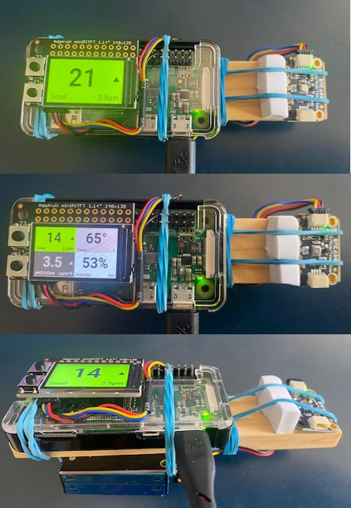
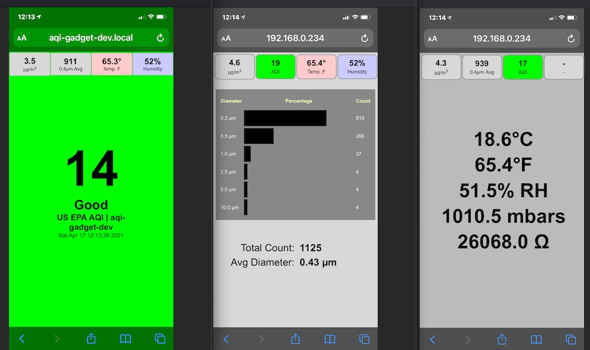

# Air Quality Index (AQI) Gadget
Python code for an AQI sensor + display

## Overview

This code runs on a Pi Zero W with a mini TFT display and a Plantower PM2.5
sensor attached. The sensor is either the same or very similar to the those
used inside of PurpleAir hardware. 

This thing was made in a couple of days during the CA wildfires in 2020. I
used it to measure how well my cobbled together air filter + fan was
working. The output matches PurpleAir's output pretty closely including
LRAPA and AQandU output. 

**WARNING** : this project is an absolute hack job. It has problems.

## Hardware

 * I2C Plantower Sensor: https://www.adafruit.com/product/4632
 * TFT mini display: https://www.adafruit.com/product/4393
 * Pi Zero W: https://www.adafruit.com/product/3400

If you want it to be mobile you can use an android phone charger battery to
power the Zero or a proper dedicated battery. Check the power requirements.

Alternately there is an older UART version which also works:

 * UART Plantower Sensor: https://www.adafruit.com/product/3686

## Display

The display is NOT set up as the linux frame buffer. Its driven directly
with ADAFruit's cpython modules. The code provides six display modes:

 1. AQI
 2. AQI with LRAPA correction
 3. AQI with AQandU correction
 4. Hostname 
 4. IP 
 5. Temp
 6. CPU Load

The first three color the background according to the AQI color codes. The
display back light times out after a minute to conserve power.

## Web Server

Once you have the Zero W on your local WIFI you can see the AQI via a built
in webserver thanks to CherryPy. The server runs on port 8081 unless its
run as root in which case it runs on port 80.

The URLs are:

    http://IPADDRESS/       :: AQI from direct sensor µg/m^3 output.
    http://IPADDRESS/aqi    :: Same as above
    http://IPADDRESS/lrapa  :: AQI from LRAPA corrected µg/m^3 output
    http://IPADDRESS/aqandu :: AQI from AQandU corrected µg/m^3 output

For any of the above you can add ?refresh=N where N is in seconds to get an
auto updating version of that page.

Also:

    http://IPADDRESS/raw    :: Returns a python tuple of data

## Buttons

There are two buttons on the mini-TFT display. They do the following:

 * Top + Bottom: exit the code and if run as root shut down the computer.
 * Top only: if display is OFF turn it on. Otherwise change display mode.
 * Bottom only: if display is OFF turn it on. Otherwise turn it OFF.
 
## Systemd Service

There's a script included you can put in /lib/systemd/system to make it
into a service on Raspbian (or PiOS?) Buster.

## Improvements

 * Cache rendered images to reduce amount of CPU usage.
 * Graph display of last hour or so (web too).
 * Clean up all the global state.
